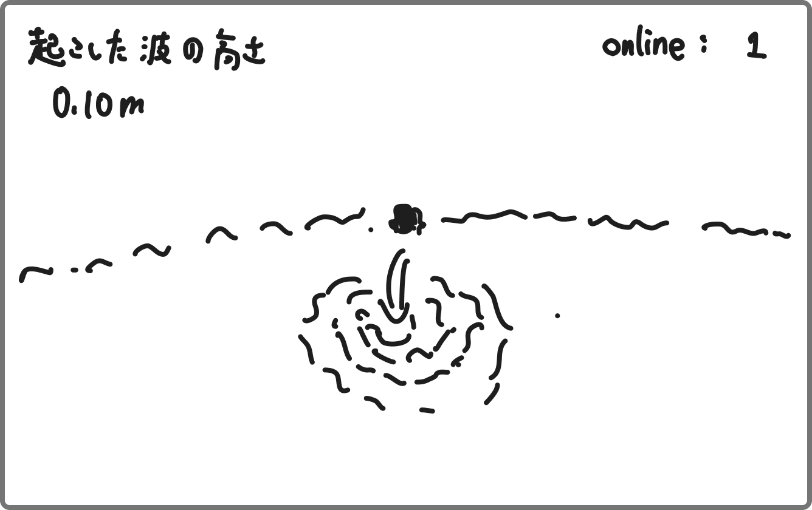

# 揺れる水面

# ゲームの趣旨

このゲームはどこまでも続く水面に石を投げ入れて、その**波紋の高さ**を競うゲームです。

# ゲーム性

このゲームでは石を投げ続けて水面の揺れを楽しめます。  
また、石を投げて生まれた波紋がどの程度の高さを持つのかを競います。

# 操作

## カメラ移動

- 水平方向にカメラは移動させられます。
- また周囲を360°見渡せます。

## 石を投げる

- スペースキーを押すと石を真下に投げます。

# 石

- 同じ位置にカメラの視点の先（常に同じ水面からの高さの地点）にリポップします。
- 常に同じ形の石がリポップします。
